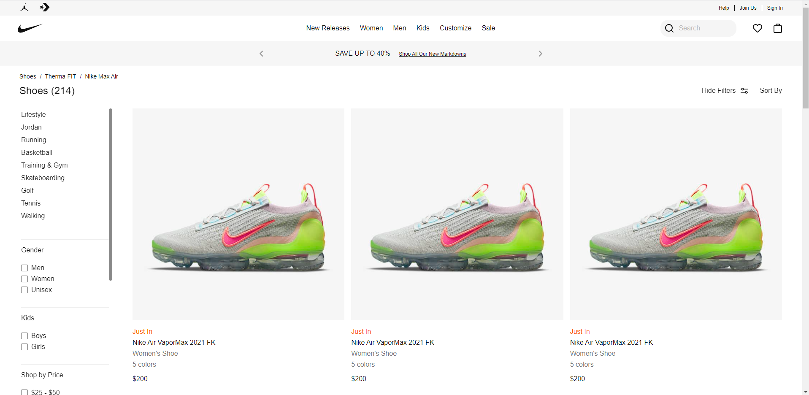
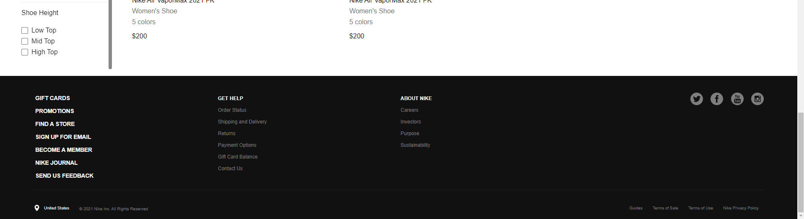
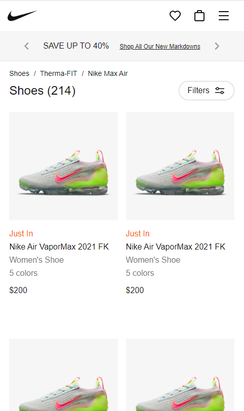
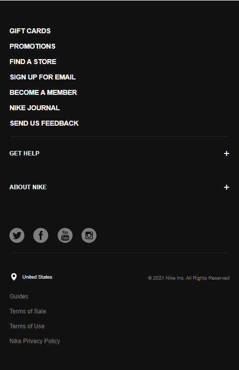
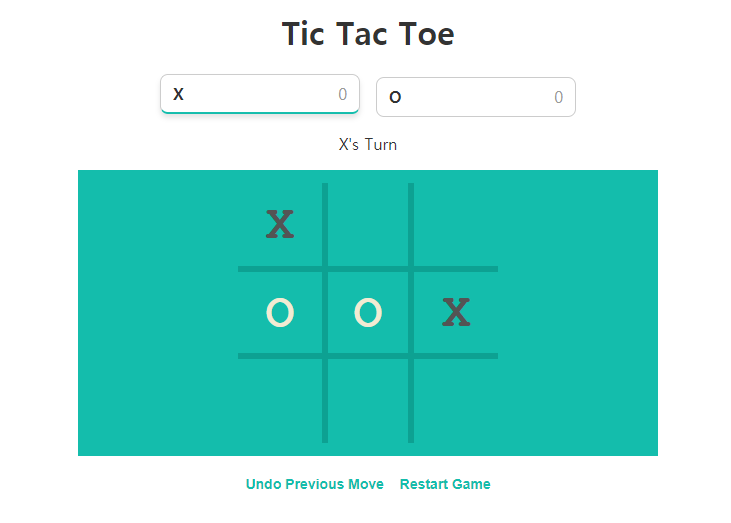
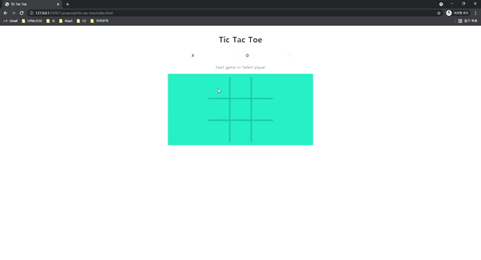
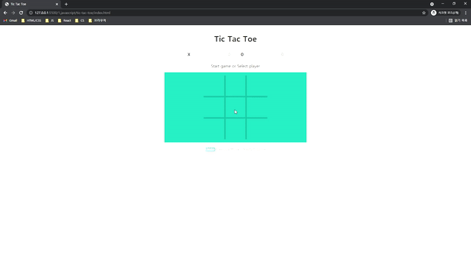
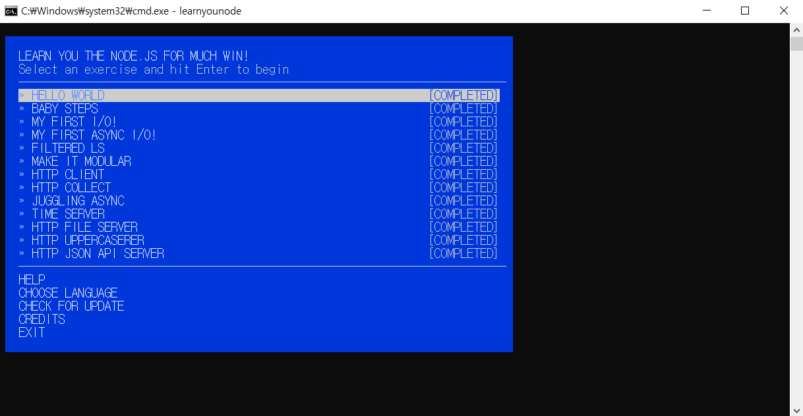

# 사전학습 연습과제 결과

## 목록
- [HTML, CSS](#html-css)
- [JavaScript](#javascript)
- [NodeJS](#nodejs)

## HTML, CSS
- [코드](./0.html-css/dist)
- 클론한 페이지: [Nike Shoes](https://www.nike.com/w/shoes-3n9k9z98pddzy7ok)
- 결과물
  - Main  
   
  
  - Footer  
   
  
  - Mobile (main)  
   
  
  - Mobile (footer)  
   
  
## JavaScript
- [코드](./1.javascript/tic-tac-toe)
- 참고한 페이지: [Google Tic-Tac-Toe](https://www.google.com/search?q=tic+tac+toe)
- 결과물
  - 화면  
   
  - 게임 플레이  
   
  - 되돌리기, 게임 재시작  
   

## NodeJS
- [코드](./2.nodejs/nodeschool)
- 결과물  
 
